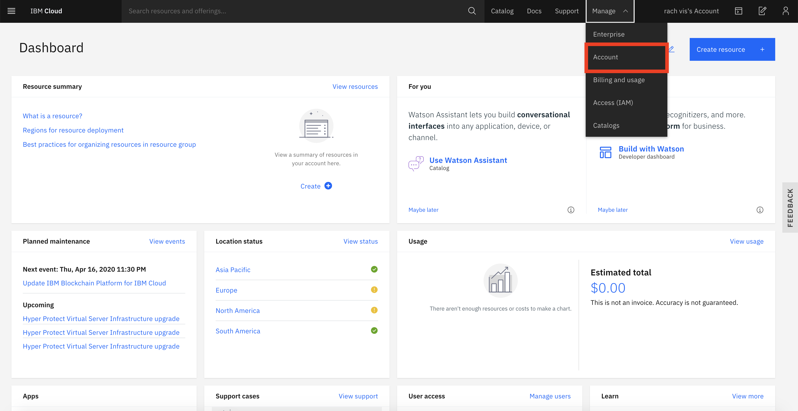
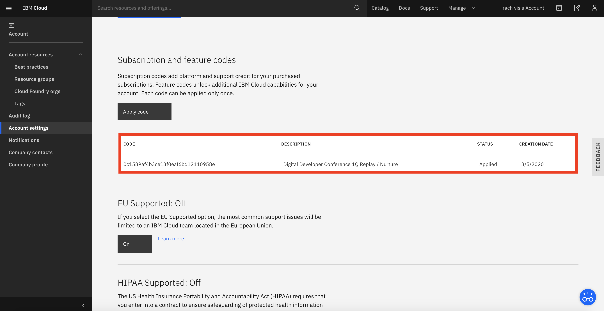
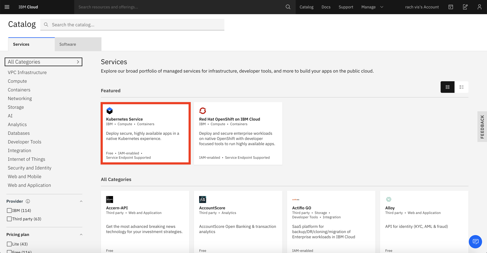
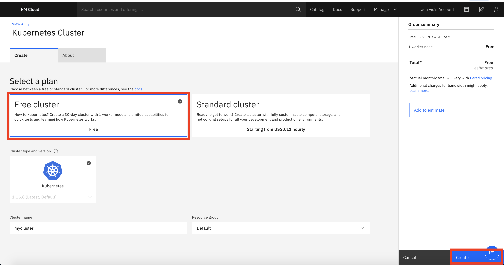

# IKS Vulnerability Advisor

## Challenge for today:

Find the vulnerabilities in the container images using vulnerability advisor on IBM Kubernetes service. Complete the following steps:

1. Sign up/Log in to [IBM Cloud](https://ibm.biz/Bdqqkx)
2. Create a kubernetes cluster on IBM Cloud
3. Push the container images into your private registry
4. Use vulnerability advisor to find the following:

i) Configuration issues identified, such as corrective actions needed, description of the issue, if the issue is exempt according to defined policies, and the type of check the issue failed.

ii) The ID of the assessment.

iii) A list of Common Vulnerabilities and Exposures (CVE) that are identified for the image: whether it is exempt, the CVE ID, security notice information, and a summary of the vulnerability.

iv) An overall status of the image based on vulnerabilities, identified configuration issues, and applied exemptions.

What are the vulnerabilities that are to be found in these images?

i) Operating system (OS) vulnerabilities: unpatched libraries and OS components, vulnerable kernel versions, and vulnerable network library versions.

ii) Configuration vulnerabilities: nonsecure OS settings, such as passwords or logins as well as network configuration, including allow root, no whitelisting of IPs, and lack of Secure Shell (SSH).

iii) Application weaknesses: XSS, buffer overloading, and SQL injection.

Use the following reference steps

## Provisioning IKS(IBM Kubernetes Service)

1. Login to you [IBM Cloud account](https://ibm.biz/Bdqqkx)

2. Go to [here](https://developer.ibm.com/callforcode/featurecode) to get a promo code, login to your IBM Cloud account, enter the code developer2020 to get a promo code.

Copy the feature code

3. Go to [IBM Cloud](https://ibm.biz/Bdqqkx)

Click on Manage, select Account.

Click on Account settings, apply code, paste the feature code you have copied.

Make sure your feature code is applied to your account

4. Create a kubernetes cluster

Click on catalog and look for Kubernetes Service

Select the plan - Free Cluster and click on create

You have successfully provisioned a Kubernetes cluster on IBM Cloud. Creation of cluster will take 15-20 minutes. Once the cluster is up and running, create a namespace and push the following images to see the vulnerabilities in them.

## Find the vulnerabilities in the following images

1. [phpldapadmin](https://hub.docker.com/r/vulnerables/phpldapadmin-remote-dump)

2. [metasploit](https://hub.docker.com/r/vulnerables/metasploit-vulnerability-emulator)

3. [web-dvwa](https://hub.docker.com/r/vulnerables/web-dvwa)

4. [web-owasp-railsgoat](https://hub.docker.com/r/vulnerables/web-owasp-railsgoat)

5. [web-roundcube-1.2.2-rce](https://hub.docker.com/r/vulnerables/web-roundcube-1.2.2-rce)

6. The following is the sample list

## Reference Code Patterns and Tutorials

1. [Detect vulnerabilities in container images and take action](https://developer.ibm.com/patterns/using-vulnerability-advisor-containers/)

2. [Encrypted container images for container image security at rest](https://developer.ibm.com/articles/encrypted-container-images-for-container-image-security-at-rest/)

3. [A journey to Kubernetes security](https://developer.ibm.com/articles/journey-to-kubernetes-security/)
